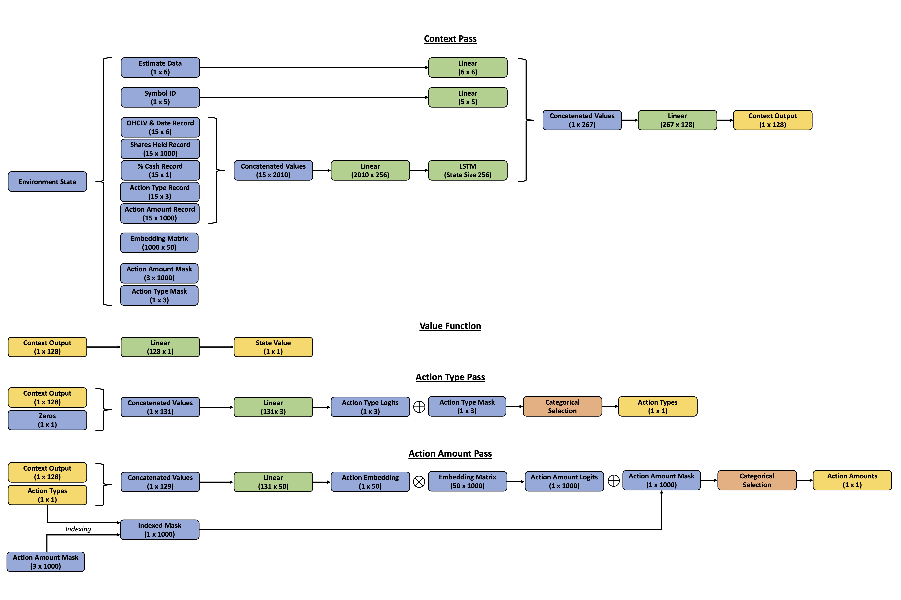
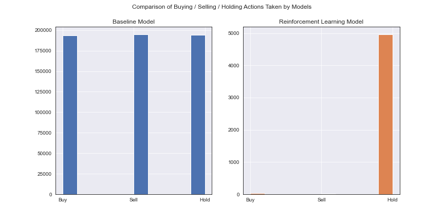
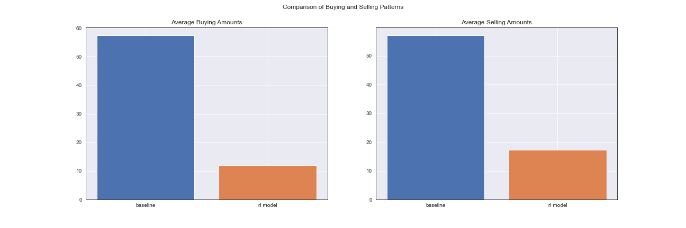
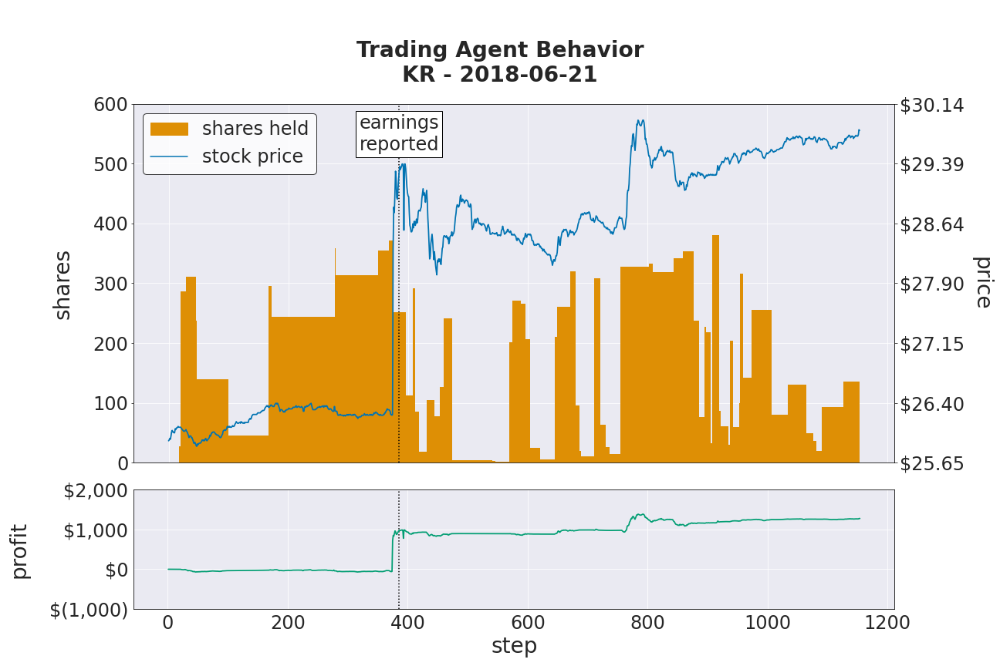
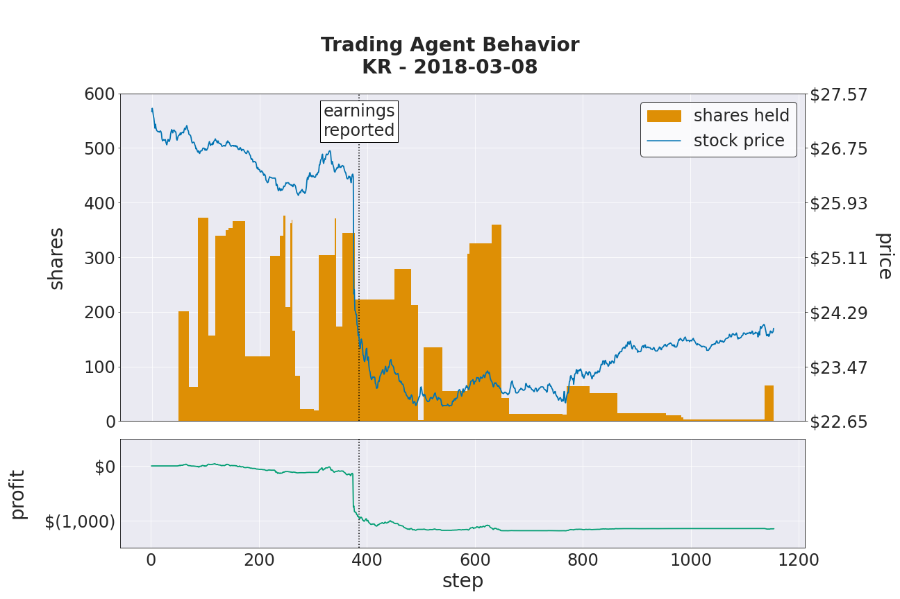
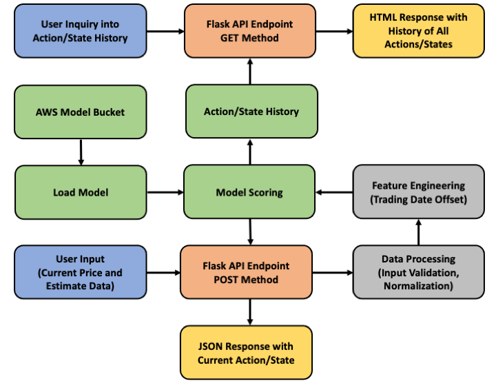
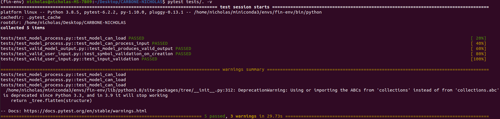
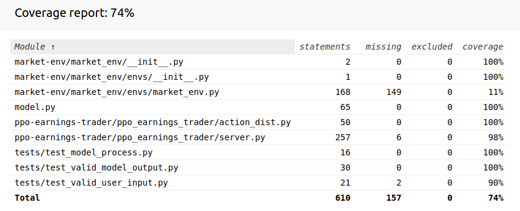

This is an archived repository originally created for my class at UCLA: STATS404 - Statistical Computing and Programming.

# An Autonomous Trading Agent for Earnings Season in the US Retail Industry

## Contents

[1 Statement of Problem](#1-Statement-of-Problem)  
[2 Intended Client](#2-Intended-Client)  
[3 Key Business Question](#3-Key-Business-Question)  
[4 Data Sources](#4-Data-Sources)  
&nbsp;&nbsp;&nbsp;&nbsp;&nbsp;&nbsp;[4.1 Notes on Data Preparation](#41-Notes-on-Data-Preparation)  
[5 Business Impact of Work](#5-Business-Impact-of-Work)  
[6 How Model will be Used](#6-How-Model-will-be-Used)  
[7 Metric to Gauge Performance](#7-Metric-to-Gauge-Performance)  
[8 Methodology](#8-Methodology)  
&nbsp;&nbsp;&nbsp;&nbsp;&nbsp;&nbsp;[8.1 Summary](#81-Summary)  
&nbsp;&nbsp;&nbsp;&nbsp;&nbsp;&nbsp;[8.2 Environment Setup](#82-Environment-Setup)  
&nbsp;&nbsp;&nbsp;&nbsp;&nbsp;&nbsp;[8.3 Observation Space](#83-Observation-Space)  
&nbsp;&nbsp;&nbsp;&nbsp;&nbsp;&nbsp;[8.4 Action Space](#84-Action-Space)  
&nbsp;&nbsp;&nbsp;&nbsp;&nbsp;&nbsp;[8.5 Reward](#85-Reward)  
&nbsp;&nbsp;&nbsp;&nbsp;&nbsp;&nbsp;[8.6 Training Procedure](#86-Training-Procedure)  
&nbsp;&nbsp;&nbsp;&nbsp;&nbsp;&nbsp;[8.7 Custom PPO Hyperparameters](#87-Custom-PPO-Hyperparameters)  
&nbsp;&nbsp;&nbsp;&nbsp;&nbsp;&nbsp;[8.8 Current Model Architecture](#88-Current-Model-Architecture)  
[9 Analysis of Results](#9-Analysis-of-Results)  
[10 Suggested Areas of Improvement](#10-Suggested-Areas-of-Improvement)  
&nbsp;&nbsp;&nbsp;&nbsp;&nbsp;&nbsp;[10.1 Model](#101-Model)  
&nbsp;&nbsp;&nbsp;&nbsp;&nbsp;&nbsp;[10.2 Environment](#102-Environment)  
&nbsp;&nbsp;&nbsp;&nbsp;&nbsp;&nbsp;[10.3 Application](#103-Application)  
[11 Further Research and Development](#11-Further-Research-and-Development)  
[12 Usage Instructions](#12-Usage-Instructions)  
&nbsp;&nbsp;&nbsp;&nbsp;&nbsp;&nbsp;[12.1 Process Diagram](#121-Process-Diagram)  
[Appendix](#Appendix)  
&nbsp;&nbsp;&nbsp;&nbsp;&nbsp;&nbsp;[A.1 Results of Code Testing Suite](#A1-Results-of-Code-Testing-Suite)  
&nbsp;&nbsp;&nbsp;&nbsp;&nbsp;&nbsp;[A.2 Notes on Docker Container](#A2-Notes-on-Docker-Container)  
&nbsp;&nbsp;&nbsp;&nbsp;&nbsp;&nbsp;[A.3 Other Application Notes](#A3-Other-Application-Notes)

## 1 Statement of Problem

During earnings season, stocks tend to see periods containing some of their highest volume and volatility of the year. Analysts forecast companies' earnings and the market uses these to gauge whether a company performed better or worse than expected in a given quarter. Upon a report, investors take the opportunity to re-assess a company's valuation. Many new investors may pour into a stock that reports favorable earnings, while others may exit when a stock reports less-than-favorable earnings. 

Per the efficient market hypothesis, all known information should be priced into the stock prior to a company's earnings, so it's difficult to predict whether or not a company will beat analyst estimates. However, there are predictable predictable phenomenon such as the volume and volatility surrounding these reports that may represent a profitable opportunity for a trading strategy that can identify them.

The US retail industry was chosen for two reasons. First, there is seasonality in the earnings of retailers, which we hypothesize should lead to greater patterns in the earnings season. Secondly, we believe companies in this industry should be impacted by similar market forces. For instance, if consumer spending generally increases in a given year, we'd expect all of these companies to see a similar increase in their revenue.

## 2 Intended Client

An investment firm without a pre-existing algorithm to trade earnings reports, or one that would like to re-evaluate its current trading strategies for these periods

## 3 Key Business Question

Are there patterns and information that could be used to predict trading activity in the periods surrounding earnings announcements for the US retail industry?

## 4 Data Sources

* List of retail stock symbols: National Retail Federation (https://nrf.com/resources/top-retailers/top-100-retailers/top-100-retailers-2019)
* Historical analyst estimates: WRDS IBES Database
* Intraday Pricing Data: WRDS TAQ Database

#### 4.1 Notes on Data Preparation

* The open, high, low, close, volume (OHCLV) data is normalized using the running means and standard deviations for the previous 10 days.
* The trading date is converted to an integer in [-1, 1] based on the relative number of trading days from when the earnings are released.
* Estimate data is fed to the model raw.

## 5 Business Impact of Work

Consider the following table of the top 5 retailers with the \% deviations in their stock price following their Q3 2020 earnings reports:

|    Company    |  \% change    |
| ------------- | ------------- |
| Walmart       | 4\%           |
| Amazon        | 6\%           |
| Costco        | 2\%           |
| Walgreen      | -5\%          |
| Kroger        | 3\%           |

-- Source: Yahoo Finance

Now suppose we have 10,000 dollars in our investment account and we would like to evenly apply this money across the companies to trade the Q3 2020 earnings season.

Suppose we had a perfect trading strategy, where we bought the stocks that increased and shorted those that decreased and took profit at these deviations. We could have earned a profit of:


($2,000 * 4%) + ($2,000 * 6%) + ($2,000 * 2%) + ($2,000 * 5%) + ($2,000 * 3%) = $2,000

Or, more simply, a 20\% increase in the account value.

This is a best case scenario, whereas our more likely profit potential exists below this amount.

Our initial findings suggest our model loses about 1\% on average. However, if we could achieve a reliable return of even just 1\%, this would translate to a roughly 22\% yearly profit compounded across just these 5 companies.

## 6 How Model will be Used 

The model is designed to make its own decisions, so ideally it would be given access to its own investment account with permission to automate trades. The company could then feed a stream of data to the model throughout a trading day and monitor the model's performance. When in production, appropriate constraints should be in place to minimize downside risk; for instance, if the model were to lose more than 10\% of its portfolio value in a single day, it should be taken offline for researchers to study its performance and improve it for future usage.

## 7 Metric to Gauge Performance

Percent increase in account value in a given year

## 8 Methodology

#### 8.1 Summary

The study seeks to compare a reinforcement learning (RL) agent to a baseline model to gauge whether the RL agent achieves a substantive improvement over the baseline.

At a glance, the baseline and RL models, respectively, are designed as follows: 

##### Baseline Model
At each timestep, the baseline model randomly selects an action to buy, sell or hold its current position. Based on this choice, it randomly selects an amount of shares to buy or sell based on its current cash balance and number of shares (i.e. the model can only sell as many shares as it actually has in its account). This strategy translates to an investor whose trading decisions are completely arbitrary. This process is repeated over 100 episodes and the results are averaged.

##### RL Model
At each timestep, the RL model is faced with the same set of decisions as the baseline model; however, it approaches its decisionmaking much more intelligently. Instead of guessing randomly, the model learns a policy by which it makes its actions. During the training process, the model probabilistically chooses to explore new actions or exploit its own knowledge of the underlying trading process. A neural network outputs an encoding of the current state to be fed into an action distribution. The action distribution consists of another neural network which produces the logits of its action type (buy/sell/hold) as well as the embedding of the amount to buy/sell/hold, conditioned on the action type. The embedding is then converted to logits using a fixed embedding matrix given by the environment. Any unavailble actions are masked out of the logits. The model selects actions from this distribution according to a policy, which is optimized using the Proximal Policy Optimization (PPO) algorithm.

#### 8.2 Environment Setup  

* The agent trades 3-day periods beginning on the earnings date. So the agent will trade one day, the market will close, the company will report its earnings and the agent will trade the following two days after that.
* The agent trades at one-minute intervals and takes an action at each and every interval. Given a sequence length of 15, this leads to 1,150 steps in a given period.
* The agent is looking at earnings dates from 2010-2019. 2020 was excluded due to many abnormalities in company's earnings with the ongoing pandemic. The agent is trained on earnings dates from 2010-2017 and dates from 2018-2019 are reserved for testing.
* Only the top 5 retailers listed under the section "Business Impact of Work" are considered.

#### 8.3 Observation Space

<ol>
    <li>A record of the values for open, high, low, close and volume for the stock's shares</li>
    <li>A record of the agent's previous actions</li>
    <li>A record of the agent's previous percentage of its cash invested</li>    
    <li>A record of the number of shares held in the agent's account</li>
    <li>The number of trading days offset from the earnings date</li>    
    <li>Analyst estimates and their summary statistics for a particular earnings date</li>
    <li>The embedding matrix for the agent's actions</li>
    <li>The acceptable list of actions based on the accounts' position</li>
</ol>

#### 8.4 Action Space

<ol>
    <li>Action type (e.g. buy, sell or hold)</li>
    <li>The amount of shares to buy or sell (a holding action type always corresponds to an amount of 0)</li>
</ol>


#### 8.5 Reward

At each step the agent receives a reward that's the sum of its profit/loss for its current position plus the opportunity cost for not investing its money further. This is summarized by the following equation, where ```t``` indicates the current timestep:

```
R(t) = [P(t) - P(t-1)] * Shares(t) + Cash(t) / [P(t) - P(t-1)]
```

The agent achieves the maximum possible reward by having its money fully invested when the price increases and having its money fully removed from the market when the price decreases. In practice, the opportunity cost term led to more stable policy updates. However, further discussion on the reward function is contained in [10.1 Model](#101-Model).

#### 8.6 Training Procedure

The model's training is handled primarily by Ray RLLib, which is an excellent library for distributed reinforcement learning. Its training is distributed across 4 workers, each with their own environment, and policy updates occur after a full episode has been completed. Its training batch size is approximately 4,000 (variable based on episode length) and its SGD minibatch size is 128. Therefore, we expect to complete four episodes in one training iteration. One training iteration on the computer it was originally trained on typically takes about 104 seconds, with the policy update being the bottleneck.

#### 8.7 Custom PPO Hyperparameters

Using Ray, an exhaustive grid search was performed on a subset of the default PPO parameters and the following were found to perform best:

* clip_param (regulates the size of a policy update): 0.4
* kl_coeff (penalty for the KL divergence between the old and new policy): 0.04
* kl_target (target for the KL divergence): 0.01
* lambda (bias-variance tradeoff for using the current and future value estimates): 0.95
* gamma (discount factor applied to expected future rewards): 0.4
* lr (learning rate): 0.0005
* entropy_coeff (bonus given to encourage exploration): 0.03

#### 8.8 Current Model Architecture

 

## 9 Analysis of Results

As a preface to this section, please note that the RL model is tested with its exploration configuration turned on. This means that the model's decisions aren't fully deterministic. Please see [10.1 Model](#101-Model) for further information.

At a high level, the model achieves similar performance to the baseline model, with both losing about 1\% of their account value on the testing data. We can examine some of the actions the models tend to take in the following graphs.

 

We see that the distribution of buying, selling and holding actions is roughly equal for the baseline model. This contrasts sharply with the RL model, which prefers to hold its current position most of the time. This mimics how real traders operate, as they typically wait until the right time to buy or sell before making ther decision. However, it could also be indicative of the model being too risk-averse and warrants further investigation. 

 

Here, we can see that the RL model is much more judicious in its buying and sellings patterns than the baseline model, which prefers to buy and sell in larger quantities, thereby assuming more risk for changes to the market. 

The next graph shows the agent's performance through its top-performing period in the testing data.

 

We see that the agent decides to build up its position heading into the earnings announcement, and then aggressively sells to take profit once the earnings are released. It earns the majority of its profit at this point in time, though it's also able to capitalize on some upward movement later on in the period. As the agent heads into the earnings announcement, we see large orange blocks with little variation, suggesting the agent might have some certainty about what may happen. We think this demonstrates that the agent has learned an important feature about earnings announcements: that the stock price may very well spike when an announcement occurs.

The next graph shows the agent's performance through its worst-performing period in the testing data.

 

Again, the agent buys into the earnings announcement, but this time the price moves in the opposite direction and the agent take a large loss. However, whereas we saw large orange blocks leading into the announcement on the last chart, there is much more variation in the agent’s behavior here, suggesting a level of uncertainty about the announcement. A goal for future research would be to teach the agent that if it does have this much uncertainty about a period, it does not need to take any action.

## 10 Suggested Areas of Improvement

#### 10.1 Model
* Most importantly, we need to note that model struggles to provide a deterministic policy. Without an exploration configuration, it often will choose to take no action through a trading period. We would ultimately never implement a model into production that is still taking random action. Here are some thoughts on this:
    * The correct actions for the model to take are more often than not to hold its current position. This may provide the model with an overwhelming sense that this is ALWAYS the right action to take and bias its policy updates towards this thinking. We could look into pre-existing models that can handle sparse rewards, which might provide strategies to circumvent this problem.
    * This could be simply be a consequence of the model being undertrained. Currently, it takes almost a full day to make it through one million environment steps. Scaling back the model to reduce the computational complexity and increasing training time may provide insight into whether this is an underlying issue.
    * Our reward function showed that it provided more stable policy updates when compared to only using the percentage increase in account value. However, our reward function, by design, can also reward the model for not taking any action when the stock price decreases. This may lead the model to believe the proper strategy is to do nothing, so looking into other reward structures may prove useful.
    * Because earnings announcements can be largely unpredictable, including the increase/decrease upon the earnings report may be too volatile for our model to be able to process. Our goal is to profit off these periods, not necessarily the actual announcement so it may be easier for the model to learn if we reorganize our methodology.
* The model is trained on sequence lengths of only 15. Again, this is a result of the computational complexity and memory needed to use larger sequence lengths. This doesn't allow the model to consider information from much earlier in the period. For example, when it's trading the 16th minute of the day after earnings are released, it no longer knows what the initial price movement after the earnings report was. Figuring out a computationally efficient way to feed this information to the model could go a long way toward improving its performance.
* While we're happy with the general concept of the model (i.e. its action masking, embedding, autoregressive conditioning and ability to process both sequenced and standalone data points), its complexity makes it difficult to understand how it learns the policy. Tensorboard is immensely helpful in providing insight into the training process, but doesn't provide the full picture when something goes wrong. Creating ways to visualize the model's training process, in the form of analyzing its gradients and output logits, would provide more clarity into what's working and what isn't.

#### 10.2 Environment
* The training environment depends on a set list of input files. It would be more computationally efficient to either serve the data from an API or implement a Torch DataReader for this purpose.

#### 10.3 Application
* Currently, the application requires a Ray RLLib model to run. This is a consequence of Ray RLLib being such an integral library to the analysis. However, the TradingServer class could be rewritten to accept a more abstract model that only needs to implement a method to return actions from an input. This would enable the application to run agnostic of the underlying model and we would relocate the action distribution module contained in the repository to AWS.
* Similarly to the first point, since different models might require different input stuctures, we'd like to generalize input handling process to accept different structures dependent on the model being passed.
* The TradingServer class performs many tasks, not all of which are intuitively related to its primary function: to send input to the model and return output to the flask API. Some of these tasks could be divided among other classes and the package would likely be more modular and readable as well as provide greater abstraction.

## 11 Further Research and Development

The primary goal for future development would be to increase the scope of the dataset the model trains on. Currently, the model looks at a relatively naive set of data. This is mostly a constraint imposed due to the additional computational complexity of increasing the size of the model. However, if the model's training were to be distributed across virtual machines, this constraint would be relaxed. Here are ideas of new data that could prove useful to the model and some discussion on their usefulness:

##### Sentiment
* Sentiment can be an incredibly large indicator of price movement in a stock. If investors have an overwhelmingly positive outlook on a company, we would expect a negative earnings surprise to lead to a greater downward movement as more people's expectations have been upended. We would consider sentiment in the form of news reports, as well as Twitter and social media data and use NLP techniques to encode representations that could be used by the model.

##### Macroeconomic factors
* We previously described in [8.2 Environment Setup](#82-Environment-Setup) how we excluded 2020 from our analysis as there were many abnormalities in company's earnings. In reality, each of the earnings seasons we look at probably have macroeconomic factors unique to that period. By incorporating these, we would provide the model with greater context on what's going on with the broader market.

##### Correlations with other assets
* Our model currently looks at the companies' earnings periods in a vacuum. However, it might be beneficial to consider what's already occurred throughout the earnings season and in earnings season's past. For instance, if we were looking at Costco's Q1 2018 earnings and Kroger had just reported a negative earnings surprise two days ago, this might be a useful indicator as to what might happen with Costco's earnings.

##### Earnings guidance from the companies
* Often times, a company will issue press releases and hold investor calls after reporting its earnings. The contents of these can have a sizable impact on assauging investor's concerns when earnings are lackluster or emboldening their beliefs when earnings are generally positive. Similarly to our suggestion for sentiment analysis, we'd use NLP techniques to encode representations of these to provide to the model.

##### Additional companies
* Only looking at 5 companies does not afford our model the ability to greatly generalize its performance. It also means we severely risk the model overfitting our data. Expanding the pool of companies we analyze could help mitigate this problem. Each new earnings period adds an additional layer of complexity to the policy the agent is learning, but this may assist the agent in not getting stuck in local optima en route to a more complete policy. 

##### Additional industries
* Our original hypothesis was that the US retail industry should provide more underlying patterns than other industries. However, this assumption was not tested. It's entirely possible that there's another industry in which our model would achieve significantly better performance, so we leave the door open to explore alternative industries.

## 12 Usage Instructions

The application is designed to run inside a Docker container. Due to the model's size, at least 7.53GB must be available on the local machine to build the image. Please see section [A.2 Notes on Docker Container](#A2-Notes-on-Docker-Container) for information on the container's contents. The model is served via a flask API endpoint that runs inside the Docker container. Instructions setting up the container, sending input through the API and receiving output follow.

From the top-level directory of the repository, the image can be built by running the following command in a shell:

```bash
sudo docker build . -t traderimg
```

Once the image has been built, you can then start the container in interactive mode with

```bash
sudo docker run -p 5000:5000 -it traderimg
```

You should then be given a shell inside the container and the application can be launched with the following command:
```bash
python app.py
```
The flask API will now be listening on port 5000.

As a side note, tests can be ran inside the container's shell with:
```bash
pytest tests/.
```

Please note that due to the computational complexity of the model, the time to complete these tests can vary greatly depending on the machine on which they're running.

From outside the container, please create a new environment with the library requests installed. This can be accomplished as such:

```bash
conda create --name req-env python==3.8.5 requests
conda activate req-env
```

Now, assuming you're in the repository's top-level directory, from inside req-env you can run the following inside a python console or script to send the input-spec to the API:

```python
import json

import requests

with open('input-spec.json', 'r') as f:
    test_input = json.load(f)

headers = {'content-type' : 'application/json'}

r = requests.post('http://0.0.0.0:5000/api/results', json=test_input, headers=headers)
```

Once the flask API returns a response, to get the output of the model, as well the agent's state, you can simply call ```r.json()```.

To get information on the history of the model's outputs based on the inputs its been sent, please visit http://0.0.0.0:5000/api/results in a web browser.

### 12.1 Process Diagram



## Appendix

#### A.1 Results of Code Testing Suite





#### A.2 Notes on Docker Container

The Docker container performs the following tasks:

<ol>
    <li>Installs system dependencies</li>
    <li>Downloads the model object from AWS</li>
    <li>Creates a conda environment from a .yml file committed to the repository</li>
    <li>Installs Python dependencies that wouldn’t be installable from requirements.txt to that conda environment</li>
    <li>Sets up the Docker container to run using the conda environment as its default shell</li>
</ol>

The idea behind Docker is that it provides a self-contained virtual operating system in which we can run an application. The rationale behind this is that different applications require different components to run, but with Docker we can know for certain that our application will run, provided the host computer has the ability to virtualize applications. In this sense, we can think of Docker as an abstract operating system.

For our purposes, we knew that the application's installation would rely heavily on the use of conda environments, so we used a miniconda base image, which is specified at the top line of the Dockerfile.

```Docker
FROM continuumio/miniconda3
```

From there, most of the steps to build the container are accomplished through ```RUN``` commands. The ```RUN``` commands execute bash commands during the build process to add additional functionality to the container. Consider the following command in my Dockerfile:

```Docker
RUN apt-get -y install cmake
```

This command installs the cmake package to the container, which will be later used as dependency for the atari-py library.

Let's now look at the setup of the conda environment. We begin by copying the .yml file and creating an environment from this file:

```Docker
ADD environment.yml /tmp/environment.yml
RUN conda env create -f /tmp/environment.yml
```
Next, we want to setup the container so that its default shell uses our conda environment. This is done by appending the environment's path to our current path and adding an activate command to our ".bashrc" file. We see this here:

```Docker
RUN echo "source activate prod-env" > ~/.bashrc
ENV PATH /opt/conda/envs/prod-env/bin:$PATH
```

We must note that in the build stage, each ```RUN``` command represents a separate instance of the Docker shell. While our previous commands ensure the container will be started with our conda environment, they do not change the shell used in the build process. We want to install a few additional packages to our environment using ```RUN``` commands, so we can change the shell being used in the build process with the following
```Docker
SHELL ["conda", "run", "-n", "prod-env", "/bin/bash", "-c"]
```

Thereafter, we can install the other python packages we need like
```Docker
RUN yes | pip install 'ray[rllib]'
```
This will install ray into our conda environment.

Finally, because the application runs on port 5000, we need to tell Docker to expose this port for the container. This is done through the ```EXPOSE``` command and looks like this
```Docker
EXPOSE 5000
```

When built, our container will have everything it needs to run the application.

#### A.3 Other Application Notes

* As with all RL algorithms, the environment is the main source of feedback for the model during training. Upon reset during training, the environment selects a new file from a list of input files, which should already be pre-processed and in json format. While the environment is useful for a training setting, its use of historical input files is not viable for a production setting where the data should be streamed. For this reason, the enviroment's functioning has been overridden in the application by the server.py file. The full training environment, however, has still been included in the repository as it's required by Ray RLLib to restore an agent from a training checkpoint. This can hopefully be relaxed in the future when Ray implements methods to export its policies for PyTorch models.
