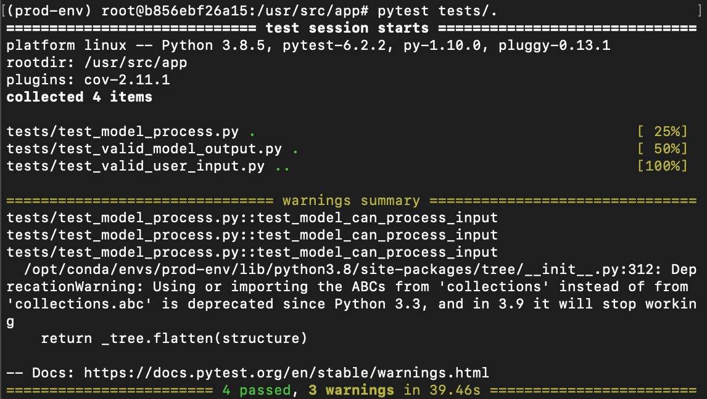

<p align="center">
<font size=8>
  <b>An Autonomous Earnings Trading Agent in the US Retail Industry</b>
    </font>
</p>

## Contents

<font size=4>
<ol>
    <li>[Statement of Problem](## 1 Statement of Problem)</li>
    <li>Intended Client</li>
    <li>Key Business Question</li>
    <li></li>    
    <li>A record of the number of shares held in the agent's account</li>
    <li>Analyst estimates and their summary statistics for a particular earnings date</li>
    <li>The embedding matrix for the agent's actions</li>
    <li>The acceptable list of actions based on the accounts' position/li>
</ol>
</font>


## 1 Statement of Problem

During earnings season, stocks tend to see periods containing some of their highest volume and volatility of the year. Analysts forecast companies' earnings and the market uses these to gauge whether a company performed better or worse than expected in a given quarter. Upon a report, investors take the opportunity re-assess a company's valuation. Many new investors may pour into a stock that reports favorable earnings, while others may leave for a stock that reports less-than-favorable earnings. 

Per the efficient market hypothesis, all known information should be priced into the stock prior to a company's earnings, so its difficult to predict whether or not a company will beat analyst estimates. However, there are predictable predictable phenomenon such as the volume and volatility surrounding these reports that may represent a profitable opportunity for a trading strategy that can identify these patterns.

The US retail industry was chosen for two reasons. First, there is seasonality in the earnings of retailers, which we hypothesize should lead to greater patterns in the earnings season. Secondly, we believe companies in this industry should be impacted by similar market forces. For instance, if consumer spending generally increases in a given year, we'd expect all of these companies to see a similar increase in their revenue.

## 2 Intended Client

An investment firm without a pre-existing algorithm to trade earnings reports, or one that would like to re-evaluate its current trading strategies for these periods.

## 3 Key Business Question

Are there patterns and information that could be used to predict trading activity in the periods surrounding earnings announcements for the US retail industry?

## 4 Data Sources

List of retail stock symbols: National Retail Federation (https://nrf.com/resources/top-retailers/top-100-retailers/top-100-retailers-2019)
Historical analyst estimates: WRDS IBES Database
Intraday Pricing Data: WRDS TAQ Database

#### Notes on Data Preparation

* The open, high, low, close, volume (OHCLV) data is normalized using the running means and standard deviations for the previous 10 days. This can be 
* 

## 5 Business impact of work

Consider the following 5 retailers listed in descending order of revenue for 2020:
* Walmart (WMT)
* Amazon (AMZN)
* Costco (COST)
* Walgreens (WBA)
* Kroger (KR)

Now suppose we have \$10,000 in our investment account and we would like to evenly apply this money across the companies to trade the Q3 2020 earnings season.

Within the 7 days following their Q3 2020 earnings reports, the companies saw the following percent deviations in their stock price, rounded to the nearest whole percent:

* Walmart: 4%  
* Amazon: 6%
* Costco: 2%
* Walgreens: -5% 
* Kroger: 3%

-- Source: Yahoo Finance

Suppose we had a perfect trading strategy, where we bought the stocks that increased and shorted those that decreased and took profit at these deviations. We could have earned a profit of:

(\$2,000 * 4\%) + ($2,000 * 6\%) + (\$2,000 * 2\%) + (\$2,000 * 5\%) + (\$2,000 * 3\%) = \$2,000

Or, more simply, a 20\% increase in the account value.

This is a best case scenario, whereas our more likely profit potential exists below this amount. 

# 6 How business will use the model to make decisions 

The model is designed to make its own decisions, so ideally it would be given access to its own investment account with permission to automate trades. The company could then feed a stream of data to the model through a trading day and the model. When in production, appropriate constraints should be in place; for instance, if the model were to lose more than 10\% of its portfolio value in a single day, it should be taken off line for researchers to study its performance and improve it for future usage.

# 7 Metric to Gauge Performance
Percent increase in account value in a given year

# 8 Methodology

### Basics

The study seeks to compare a reinforcement learning (RL) agent to a baseline model to gauge whether the RL agent achieves a substantive improvement over the baseline. The two models trade at one-minute intervals and make a decision on the at each and every one of those intervals.

At a glance, the baseline and RL models, respectively, are designed as follows: 
<ol>
    <li>At each timestep, the baseline model randomly selects an action to buy, sell or hold its current position. Based on this choice, it randomly selects an amount of shares to buy or sell based on its current cash balance and number of shares (i.e. the model can only sell as many shares as it actually has in its account. This process is similar to a random walk and would represent an investor whose trading decisions are completely arbitrary. This process is repeated over 100 episodes and the results averaged.</li>
    <li>At each timestep, the RL model is faced with the same set of decisions as the baseline model; however, it approaches its decisionmaking much more intelligently. Instead of guessing randomly, the model learns a policy by which it makes its actions. During the training process, the model probabilistically chooses to explore new actions or exploit its own knowledge of the underlying trading process. A neural network outputs an encoding of the current state to be fed into an action distribution. The action distribution consists of another neural network which produces the logits of its action type (buy/sell/hold) as well as the embedding of the amount to buy/sell/hold, conditioned on the action type. The embedding is then converted to logits using a fixed embedding matrix given by the environment. Any unavailble actions are masked out of the logits. The model selects actions from this distribution according to a policy, which is optimized using the Proximal Policy Optimization (PPO) algorithm.
</ol>

### What we're looking at

* The agent trades 3-day periods beginning on the earnings date. So the agent will trade one day, the market will close, the company will report its earnings and the agent will trade the following two days after that.
* The agent is looking at earnings dates from 2010-2019. 2020 was excluded due to many abnormalities in company's earnings with the ongoing pandemic. The agent is trained on earnings dates from 2010-2017 and dates from 2018-2019 are reserved for testing.
* The top 5 retailers listed under the section "Business Impact of Work".

### Environment

The environment and its states consists of the following components:
<ol>
    <li>A record of the values for open, high, low, close and volume for the stock's shares</li>
    <li>The offset
    <li>A record of the agent's previous actions</li>
    <li>A record of the agent's previous percentage of its cash invested</li>    
    <li>A record of the number of shares held in the agent's account</li>
    <li>Analyst estimates and their summary statistics for a particular earnings date</li>
    <li>The embedding matrix for the agent's actions</li>
    <li>The acceptable list of actions based on the accounts' position/li>
</ol>

### Action Space
<ol>
    <li>Action type (e.g. buy, sell or hold)</li>
    <li>The amount of shares to buy or sell (a holding action type always corresponds to an amount of 0)</li>
</ol>

### Custom PPO Hyperparameters

The model is built on top of Ray RLLib, which is an excellent library for distributed reinforcement learning. An exhaustive grid search was performed on a subset of the default PPO parameters and the following were found to perform best:

<ol>
    <li>clip_param (regulates the size of a policy update): 0.4</li>
    <li>kl_coeff (penalty for the KL divergence between the old and new policy): 0.04</li>
    <li>kl_target (target for the KL divergence): 0.01</li>
    <li>lambda (bias-variance tradeoff for using the current and future value estimates): 0.95</li>
    <li>gamma (discount factor applied to expected future rewards): 0.4</li>
    <li>lr (learning rate): 0.0005</li>
    <li>entropy_coeff (bonus given to encourage exploration): 0.03</li>
</ol>

### Current Model Architecture

 

# 12 Usage Instructions

The application is designed to run inside a Docker container. Please see the "Notes on building Docker container" section for information on the container's contents. From the top-level directory of the repository, the image can be built by running the following command in a shell:

```bash
docker build . -t traderimg
```

Once the image has been built, you can then start the container with

```bash
docker run -p 5000:5000 -it traderimg
```

You should then be given a shell inside the container and the application can be launched with the following command:
```bash
python app.py
```

As a side note, tests can be ran inside the container's shell with:
```bash
pytest tests/.
```

Please note that due to the computational complexity of the model, the time to complete these tests can vary greatly depending on the machine on which they're running.

The flask API will now be listening on port 5000. From outside the container, please create a new environment with the library requests installed. This can as such:

```bash
conda create --name req-env python==3.8.5 requests
conda activate req-env
```

Now, assuming you're in the repository's top-level directory, from inside req-env you can run the following inside a python console or script to send the input-spec to the API:

```python
import json

import requests

with open('input-spec.json', 'r') as f:
    test_input = json.load(f)

headers = {'content-type' : 'application/json'}

r = requests.POST('http://0.0.0.0:5000/api/results', json=test_input, headers=headers)
```

Once the flask API returns a response, to get the output of the model, as well the agent's state, you can simply call ```r.json()```.

To get information on the history of the model's outputs based on the inputs its been sent, please visit http://0.0.0.0:5000/api/results in a web browser.

### Process Diagaram


# Appendix A: Results of Code Testing Suite




# Appendix B: Notes on building Docker container

1)	Installs system dependencies
2)	Downloads the model object from AWS
3)	Creates a conda environment from a .yml file committed to the repository
4)	Installs Python dependencies that wouldn’t be installable from requirements.txt to that conda environment
5)	Sets up the Docker container to run using the conda environment as its default shell

